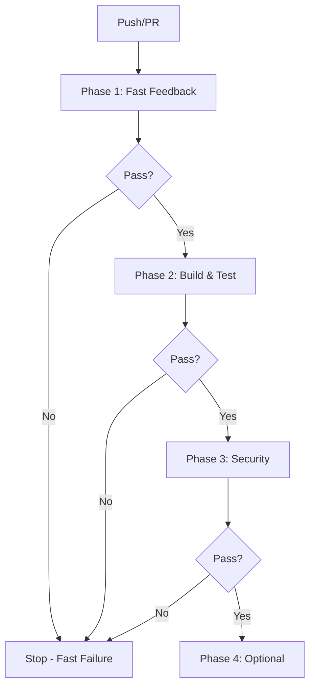

# CI/CD Workflow Architecture

## 🎯 Design Philosophy

This CI/CD system is architected around **critical role-based personas**, each responsible for a specific quality dimension. This is not incremental improvement—it's a **complete rewrite** based on production-grade DevOps practices.

## 🏗️ Core Principles

### 1. Role-Based Separation of Concerns
Each workflow represents a critical role with **single responsibility**:
- **Master Architect**: Validates architectural patterns
- **Code Quality Engineer**: Enforces code standards
- **Security Engineer**: Ensures test coverage
- **Zero-Day Expert**: Catches vulnerabilities

### 2. Fail Fast Philosophy
```
Phase 1 (< 5 min): Architecture + Quality
    ↓ PASS
Phase 2 (< 15 min): Build + Tests
    ↓ PASS
Phase 3 (< 10 min): Security
    ↓ PASS
Phase 4 (Optional): Production scenarios, benchmarks
```

**Benefit**: Get feedback in 5 minutes vs 20+ minutes

### 3. Quality Gates at Every Layer
```
Architecture Compliance
    ↓
Code Quality Standards
    ↓
Comprehensive Testing
    ↓
Security Validation
    ↓
Production Readiness
```

**Each gate must pass before proceeding.**

### 4. Modular & Maintainable
```
.github/workflows/
├── 00-orchestrator.yml           # Single coordinator
├── 01-architect/                  # Architecture module
│   └── validate-architecture.yml
├── 02-quality/                    # Quality module
│   └── code-quality.yml
└── ...
```

**Benefit**: Update one role without touching others

## 📐 Architectural Patterns

### Pattern 1: Orchestration (Coordinator Pattern)
```yaml
# 00-orchestrator.yml
jobs:
  phase1-fast-feedback:
    # Coordinate parallel execution
    # Fast failure propagation
  
  architect:
    needs: phase1-fast-feedback
    uses: ./.github/workflows/01-architect/validate-architecture.yml
  
  code-quality:
    needs: phase1-fast-feedback
    uses: ./.github/workflows/02-quality/code-quality.yml
```

**Benefits**:
- Central control point
- Dependency management
- Phase-based execution
- Reusable workflows

### Pattern 2: Single Responsibility (Role Pattern)
Each workflow does ONE thing:

```yaml
# 01-architect/validate-architecture.yml
# Responsibility: Validate DDD, EDA, Hexagonal patterns
# NOT responsible for: Testing, security, quality

# 02-quality/code-quality.yml
# Responsibility: Enforce code standards
# NOT responsible for: Architecture, security, testing
```

### Pattern 3: Reusable Workflows (DRY)
```yaml
# Main orchestrator calls reusable workflows
uses: ./.github/workflows/01-architect/validate-architecture.yml

# Can also be called directly:
# - From other workflows
# - Manually triggered
# - On schedule
```

### Pattern 4: Layered Security (Defense in Depth)
```
Layer 1: Code Quality (prevent bad code)
    ↓
Layer 2: Testing (catch logic errors)
    ↓
Layer 3: Static Analysis (find vulnerabilities)
    ↓
Layer 4: Dynamic Analysis (runtime issues)
    ↓
Layer 5: Penetration Testing (exploit attempts)
```

### Pattern 5: Progressive Enhancement
```
Required Checks (Always Run):
- Architecture validation
- Code quality
- Unit tests
- Security audit

Optional Checks (Scheduled):
- Benchmarks
- Load testing
- Fuzzing
- E2E scenarios
```

## 🎭 Role Responsibilities

### Role: Master Architect
**Domain**: System architecture
**Validates**:
- Domain-Driven Design (Bounded Contexts)
- Event-Driven Architecture (Choreography)
- Hexagonal Architecture (Ports & Adapters)
- IPC Matrix compliance

**Authority**: Can block merge on architectural violations

**Metrics**:
- Subsystem isolation: 100%
- Domain purity: 100% (no I/O in domain/)
- Event-driven communication: 100%
- IPC compliance: 100%

### Role: Code Quality Engineer
**Domain**: Code standards
**Validates**:
- Formatting (rustfmt)
- Linting (clippy strict)
- Complexity (≤ 25 cognitive complexity)
- Documentation (100% coverage)

**Authority**: Can block merge on quality violations

**Metrics**:
- Clippy warnings: 0 (treated as errors)
- Cognitive complexity: ≤ 25
- Function length: ≤ 100 lines
- Documentation coverage: 100%

### Role: Security Engineer
**Domain**: Testing
**Validates**:
- Unit tests (domain + service)
- Integration tests (cross-subsystem)
- Test isolation
- TDD compliance

**Authority**: Can block merge on test failures

**Metrics**:
- Test coverage: > 80%
- Test isolation: 100%
- Test performance: < 5 min
- TDD compliance: 100%

### Role: Zero-Day Expert
**Domain**: Security
**Validates**:
- Known vulnerabilities (CVEs)
- Dependency security
- SAST (code analysis)
- Cryptography
- Memory safety

**Authority**: Can block merge on security issues

**Metrics**:
- Known CVEs: 0
- Hardcoded secrets: 0
- Weak crypto: 0
- Memory safety issues: 0

## 🔄 Workflow Execution Model

### Sequential Phases (Fail Fast)


### Parallel Execution (Within Phases)
```
Phase 1 (Parallel):
├── Master Architect      [3-5 min]
└── Code Quality          [4-6 min]
= Total: ~5 min (not 9 min)

Phase 2 (Parallel):
├── Security Engineer     [10-15 min]
└── Scalability          [10-15 min]
= Total: ~15 min (not 30 min)
```

## 🎯 Quality Gates

### Gate 1: Architecture (Master Architect)
**Must Pass**:
- ✅ No direct subsystem coupling
- ✅ Domain layer is pure (no I/O)
- ✅ Events used for communication
- ✅ IPC envelopes used correctly
- ✅ Hexagonal structure maintained

**Failure Examples**:
```rust
// ❌ Direct subsystem import
use qc_02_block_storage::internal::StorageBlock;

// ❌ I/O in domain layer
pub async fn validate_block(db: &Database) { ... }

// ❌ Identity in payload
pub struct Request {
    pub requester_id: u8,  // FORBIDDEN
}
```

### Gate 2: Code Quality
**Must Pass**:
- ✅ All code formatted (rustfmt)
- ✅ Zero clippy warnings
- ✅ All functions documented
- ✅ No unsafe code without safety comments
- ✅ No .unwrap() in production code

**Failure Examples**:
```rust
// ❌ Unformatted code
fn foo(){let x=5;return x;}

// ❌ Clippy warning
let x = some_option.unwrap();  // Use .expect() or match

// ❌ Missing docs
pub fn critical_function() { ... }  // No doc comment

// ❌ Unsafe without comment
unsafe { ... }  // No SAFETY comment
```

### Gate 3: Testing (Security Engineer)
**Must Pass**:
- ✅ All tests pass
- ✅ Test coverage > 80%
- ✅ Tests are isolated
- ✅ No flaky tests
- ✅ Integration tests for choreography

**Failure Examples**:
```rust
// ❌ Implementation without test
pub fn new_feature() { ... }  // No #[test] exists

// ❌ Test ordering dependency
#[test]
fn test_2() {
    // Depends on test_1 running first ❌
}

// ❌ Flaky test
assert!(random::<bool>());  // Non-deterministic
```

### Gate 4: Security (Zero-Day Expert)
**Must Pass**:
- ✅ No known vulnerabilities
- ✅ All dependencies audited
- ✅ No hardcoded secrets
- ✅ Strong cryptography only
- ✅ Memory safe

**Failure Examples**:
```rust
// ❌ Hardcoded secret
const API_KEY: &str = "secret123";

// ❌ Weak crypto
use md5::Md5;  // Weak algorithm

// ❌ SQL injection vector
let query = format!("SELECT * FROM users WHERE id = {}", user_input);

// ❌ Unsafe without safety proof
unsafe { *ptr = value }  // No SAFETY comment
```

## 📊 Metrics & Monitoring

### Workflow Performance
- **Phase 1 Duration**: Target < 5 min
- **Phase 2 Duration**: Target < 15 min
- **Phase 3 Duration**: Target < 10 min
- **Total Critical Path**: Target < 30 min

### Quality Metrics
- **Clippy Warnings**: 0 (always)
- **Test Coverage**: > 80%
- **Architecture Compliance**: 100%
- **Security Issues**: 0 (CRITICAL/HIGH)

### Developer Experience
- **Time to First Feedback**: < 5 min
- **False Positive Rate**: < 5%
- **CI Reliability**: > 99%
- **Developer Satisfaction**: > 8/10

## 🔒 Security Architecture

### Supply Chain Security
```
Source Control (GitHub)
    ↓ [Signed commits]
Dependencies (crates.io)
    ↓ [cargo-deny validation]
Build (GitHub Actions)
    ↓ [Hardened runners]
Artifacts (GitHub Packages)
    ↓ [Cosign signatures]
Deployment (Production)
    ↓ [Verified images]
```

### Defense Layers
1. **Code Quality**: Prevent introduction of vulnerabilities
2. **SAST**: Find vulnerabilities in code
3. **SCA**: Find vulnerabilities in dependencies
4. **Secrets Scanning**: No hardcoded credentials
5. **Container Scanning**: No OS vulnerabilities
6. **Runtime Protection**: Monitor for exploits

## 🚀 Scalability

### Horizontal Scaling (More Workflows)
Add new roles without modifying existing:
```bash
# Add new role:
mkdir -p .github/workflows/11-new-role
vim .github/workflows/11-new-role/workflow.yml

# Register in orchestrator:
vim .github/workflows/00-orchestrator.yml
# Add to appropriate phase
```

### Vertical Scaling (Optimize Existing)
Improve individual workflow performance:
- Use caching (cargo registry, build artifacts)
- Parallel execution within workflow
- Incremental compilation
- Sparse checkouts

### Resource Optimization
```yaml
# Critical workflows: Always run
concurrency:
  group: ${{ github.workflow }}-${{ github.ref }}
  cancel-in-progress: true

# Expensive workflows: Scheduled only
if: github.event_name == 'schedule'
```

## 📚 References

### Internal Documentation
- `.github/workflows/README.md` - User guide
- `.github/workflows/MIGRATION.md` - Migration plan
- `CLAUDE.md` - Developer guide
- `Documentation/Architecture.md V2.3` - System architecture

### External Standards
- [GitHub Actions Best Practices](https://docs.github.com/en/actions/security-guides/security-hardening-for-github-actions)
- [OWASP DevSecOps](https://owasp.org/www-project-devsecops-guideline/)
- [Rust API Guidelines](https://rust-lang.github.io/api-guidelines/)
- [Domain-Driven Design](https://martinfowler.com/bliki/DomainDrivenDesign.html)

## 🔄 Continuous Improvement

### Weekly Review
- Review workflow performance metrics
- Identify bottlenecks
- Optimize slow workflows

### Monthly Review
- Review quality metrics trends
- Update thresholds if needed
- Add new roles if gaps identified

### Quarterly Review
- Major architecture review
- Tool upgrades
- Process improvements

---

**Version**: 2.0.0
**Last Updated**: 2025-12-12
**Status**: Production Ready
**Maintainer**: DevOps Team
