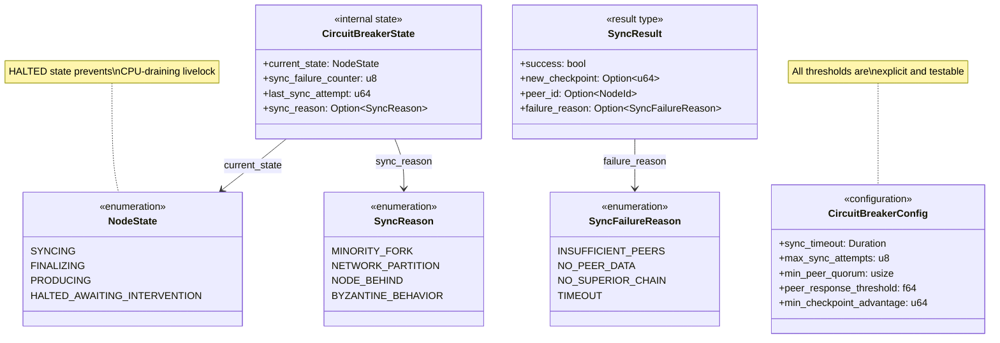

# DATA ARCHITECTURE VISUALIZATION
## Quantum-Chain System Entities Class Diagram
**Version:** 2.2 | **Generated:** 2025-12-01 | **Status:** Architecture v2.2 Compliant

---

## Overview

This document provides Mermaid.js Class Diagrams representing all system entities
as defined in the IPC-MATRIX.md, System.md, and Architecture.md specifications.

**Key Architectural Compliance (v2.2):**
- All messages wrapped in `AuthenticatedMessage<T>` envelope
- Envelope `sender_id` is the SOLE source of truth for identity (no payload identity fields)
- Block Storage uses Stateful Assembler pattern (choreography, not orchestration)
- Time-bounded nonce cache for replay prevention

> **Note:** Diagrams are split by domain cluster for clarity.

---

## Diagram 1: The Envelope (Universal Message Container)

The `AuthenticatedMessage<T>` wraps ALL inter-subsystem communication.

---

## Diagram 2: Cluster A - The Chain (Block & Transaction Structures)

Core blockchain data structures for persistence.

---

## Diagram 3: Cluster A (cont.) - Transactions

Transaction lifecycle from receipt to inclusion.

---

## Diagram 4: Cluster B - Consensus

Validator and consensus proof structures.

---

## Diagram 5: Cluster B (cont.) - Finality (Casper FFG)

Attestation and finality proof structures.

---

## Diagram 6: Cluster C - State Management

Account state and Merkle tree structures.

---

## Diagram 7: Cluster D - Networking (Peer Discovery)

Kademlia DHT peer management structures.

---

## Diagram 8: IPC Payloads - Choreography Events (v2.2)

Event payloads for the decentralized block assembly flow.

---

## Diagram 9: IPC Payloads - Request/Response

Request and response payloads using correlation_id pattern.

---

## Diagram 10: Stateful Assembler (Block Storage Internal - v2.2)

Internal state for choreographed block assembly.

---

## Diagram 11: Security - Time-Bounded Nonce Cache (v2.1)

Replay prevention with garbage collection.

---

## Diagram 12: Circuit Breaker (Finality - v2.2 Deterministic)

Deterministic failure handling with testable thresholds.

---

## Diagram 13: Data Flow Overview (Choreography Pattern)

High-level view of the v2.2 block assembly flow.

---

## Relationship Legend

| Symbol | Meaning | Example |
|--------|---------|---------|
| `*--` | **Composition** (strong has-a, lifecycle bound) | Block *-- BlockHeader |
| `o--` | **Aggregation** (weak has-a, independent lifecycle) | PeerList o-- PeerInfo |
| `-->` | **Association** (refers to, uses) | ValidatedBlock --> ConsensusProof |
| `..>` | **Dependency** (depends on, hash reference) | BlockHeader ..> Block (parent_hash) |

---

## Architecture v2.2 Compliance Notes

### 1. Envelope-Only Identity (Amendment 4.2)
All IPC payloads in this diagram have **NO** `requester_id` or `sender_id` fields.
Identity is derived ONLY from the `AuthenticatedMessage<T>` envelope's `sender_id` field.

### 2. Choreography Pattern (Amendment 4.1)
The `Subsystem_2_Internal` namespace shows the **Stateful Assembler** pattern:
- `PendingBlockAssembly` buffers incoming components
- `AssemblyBuffer` coordinates the three events: `BlockValidated`, `MerkleRootComputed`, `StateRootComputed`
- Atomic write occurs ONLY when all three components are present

### 3. Deterministic Circuit Breaker (Amendment 4.3)
The `Subsystem_9_CircuitBreaker` namespace shows:
- `CircuitBreakerConfig` with explicit, testable thresholds
- `SyncResult` and `SyncFailureReason` for deterministic outcomes
- `NodeState::HALTED_AWAITING_INTERVENTION` for livelock prevention

### 4. Time-Bounded Nonce Cache (Amendment 2.3 v2.1)
The `Security_TimeBoundedNonce` namespace shows:
- `NonceCache` with garbage collection
- `NonceEntry` with timestamp for expiration
- Prevents memory exhaustion attacks

---

## Subsystem Ownership Matrix

| Diagram | Subsystem ID | Owner | Responsibility |
|---------|--------------|-------|----------------|
| 1 | All | Architecture | Message authentication |
| 2-3 | 2, 6 | Persistence/Mempool | Block & transaction storage |
| 4-5 | 8, 9 | Consensus/Finality | Block validation & finalization |
| 6 | 3, 4 | Indexing/State | Merkle & state management |
| 7 | 1 | Networking | Peer discovery |
| 8-9 | Various | IPC | Message definitions |
| 10 | 2 | Persistence | Internal assembly state |
| 11 | All | Security | Replay prevention |
| 12 | 9 | Finality | Failure handling |
| 13 | 2, 3, 4, 8 | Multiple | Choreography flow |

---

## Version History

| Version | Date | Changes |
|---------|------|---------|
| 1.0 | 2025-11-30 | Initial single diagram |
| 2.0 | 2025-12-01 | Added v2.0 amendments |
| 2.1 | 2025-12-01 | Added time-bounded nonce cache |
| 2.2 | 2025-12-01 | Split into 13 focused diagrams for readability |
- `NonceEntry` with timestamp for expiration
- Prevents memory exhaustion attacks

---

## Subsystem Ownership Matrix

| Namespace | Subsystem ID | Owner | Responsibility |
|-----------|--------------|-------|----------------|
| `Core_Envelope` | All | Architecture | Message authentication |
| `Subsystem_1_PeerDiscovery` | 1 | Networking | Peer management |
| `Subsystem_2_BlockStorage` | 2 | Persistence | Block persistence |
| `Subsystem_2_Internal` | 2 | Persistence | Assembly coordination |
| `Subsystem_3_TransactionIndexing` | 3 | Indexing | Merkle proofs |
| `Subsystem_4_StateManagement` | 4 | State | Account state |
| `Subsystem_6_Mempool` | 6 | Transactions | Transaction pool |
| `Subsystem_8_Consensus` | 8 | Consensus | Block validation |
| `Subsystem_9_Finality` | 9 | Finality | Casper FFG |
| `Subsystem_9_CircuitBreaker` | 9 | Finality | Failure handling |
| `IPC_Payloads_*` | Various | IPC | Message definitions |
| `Security_*` | All | Security | Attack prevention |

---

## Version History

| Version | Date | Changes |
|---------|------|---------|
| 1.0 | 2025-11-30 | Initial diagram |
| 2.0 | 2025-12-01 | Added v2.0 amendments |
| 2.1 | 2025-12-01 | Added time-bounded nonce cache |
| 2.2 | 2025-12-01 | Added choreography pattern, deterministic triggers, envelope-only identity |
