# Rust Algorithm Learning Roadmap
## From Foundation to Quantum-Inspired Optimization

> **Core Principle:** Rust forces you to see what algorithms *actually do* at the hardware level. This roadmap builds your understanding layer by layer.

---

## 📊 The Learning Path Overview


---

## 🎯 Complexity Progression Chart

```mermaid
graph LR
    subgraph "Phase 1: Sorting"
    S1[O n²<br/>Bubble Sort]
    S2[O n log n<br/>Merge/Quick/Heap]
    S1 -->|Optimization| S2
    end
    
    subgraph "Phase 2: Graphs"
    G1[O V+E<br/>BFS/DFS]
    G2[O E log V<br/>Dijkstra]
    G1 -->|Add Priority Queue| G2
    end
    
    subgraph "Phase 3: DP"
    D1[O 2^n<br/>Naive Recursion]
    D2[O n²<br/>Memoized DP]
    D1 -->|Cache Results| D2
    end
    
    subgraph "Phase 4: Quantum"
    Q1[O N<br/>Linear Search]
    Q2[O √N<br/>Grover-Inspired]
    Q1 -->|Probability Magic| Q2
    end
    
    S2 --> G1
    G2 --> D1
    D2 --> Q1
    
    style S1 fill:#ff6b6b
    style S2 fill:#ff8787
    style G1 fill:#4ecdc4
    style G2 fill:#6dd5db
    style D1 fill:#45b7d1
    style D2 fill:#6bc5db
    style Q1 fill:#96ceb4
    style Q2 fill:#aad9c4
```



---

## PHASE 1: SORTING ALGORITHMS 🔴
**Foundation: Understanding Memory**

### Why This Phase First?
Sorting teaches you **how Rust thinks about memory**. Every swap, every allocation, every borrow is explicit.

### Algorithms to Learn

#### 1. Bubble Sort
```
Complexity: O(n²)
Memory: O(1) in-place
```

**What you learn:**
- ✅ Basic loops with `for` and `while`
- ✅ Mutable borrows with `&mut`
- ✅ Swap operations
- ✅ Why inefficiency is expensive

**Rust Concepts:**
```rust
fn bubble_sort(arr: &mut [i32]) {
    // You learn: &mut means "I can change this"
    // Every swap is VISIBLE and has COST
}
```

#### 2. Merge Sort
```
Complexity: O(n log n)
Memory: O(n) - allocates new arrays
```

**What you learn:**
- ✅ Dividing ownership with slice splitting
- ✅ Recursion with borrowed data
- ✅ Merging and allocating new Vecs
- ✅ When to allocate vs modify in-place

**Key Insight:** Sometimes new memory is faster than complex in-place operations

#### 3. Quick Sort
```
Complexity: O(n log n) average, O(n²) worst
Memory: O(log n) stack space
```

**What you learn:**
- ✅ In-place partitioning
- ✅ `split_at_mut()` for splitting mutable slices
- ✅ Cache locality matters
- ✅ Pivot selection strategies

**Key Insight:** Most practical sort - balances theory and real hardware

#### 4. Heap Sort
```
Complexity: O(n log n) guaranteed
Memory: O(1) in-place
```

**What you learn:**
- ✅ Implicit data structures (array as tree)
- ✅ Index manipulation vs pointers
- ✅ Heap property maintenance
- ✅ Foundation for priority queues

### Phase 1 Visual: Sorting Comparison

```mermaid
graph TD
    subgraph "Memory Usage"
    B[Bubble: O 1]
    M[Merge: O n]
    Q[Quick: O log n]
    H[Heap: O 1]
    end
    
    subgraph "Time Complexity"
    BT[Bubble: O n²]
    MT[Merge: O n log n]
    QT[Quick: O n log n avg]
    HT[Heap: O n log n]
    end
    
    B -.->|Slow but Simple| BT
    M -.->|Fast but Allocates| MT
    Q -.->|Fastest in Practice| QT
    H -.->|Guaranteed Fast| HT
    
    style BT fill:#ff6b6b
    style MT fill:#45b7d1
    style QT fill:#96ceb4
    style HT fill:#feca57
```



**Phase 1 Result:** ✅ You understand ownership, borrowing, and memory layout

---

## PHASE 2: GRAPH ALGORITHMS 🔵
**Building: Complex Relationships**

### Why This Phase Second?
Real-world data isn't linear arrays - it's networks of relationships. Graphs teach you complex data structures.

### Algorithms to Learn

#### 5. Graph Representation
```
Memory: O(V + E)
```

**What you learn:**
- ✅ Adjacency lists with `Vec<Vec<usize>>`
- ✅ HashMaps for sparse graphs
- ✅ Modeling relationships in Rust's type system

#### 6. Breadth-First Search (BFS)
```
Complexity: O(V + E)
Memory: O(V) for queue
```

**What you learn:**
- ✅ Queue operations with `VecDeque`
- ✅ Visited tracking with `HashSet`
- ✅ Level-by-level traversal
- ✅ Shortest path in unweighted graphs

**Use Cases:** Web crawling, social networks, shortest paths

#### 7. Depth-First Search (DFS)
```
Complexity: O(V + E)
Memory: O(V) for stack
```

**What you learn:**
- ✅ Stack vs Queue behavior
- ✅ Recursion with borrowing
- ✅ Backtracking patterns
- ✅ Cycle detection

**Use Cases:** Maze solving, topological sort, finding cycles

#### 8. Dijkstra's Algorithm
```
Complexity: O((V + E) log V)
Memory: O(V)
```

**What you learn:**
- ✅ Priority queues with `BinaryHeap`
- ✅ Custom `Ord` trait implementations
- ✅ Greedy algorithms
- ✅ Path reconstruction

**Use Cases:** GPS navigation, network routing, any weighted graph

#### 9. A* Search
```
Complexity: O(E) with good heuristic
Memory: O(V)
```

**What you learn:**
- ✅ Heuristic functions
- ✅ Informed search
- ✅ Domain knowledge beats brute force

**Use Cases:** Game AI, pathfinding, robotics

### Phase 2 Visual: Graph Traversal


### Phase 2 Visual: Dijkstra vs A*


**Phase 2 Result:** ✅ You can model and traverse complex relationships

---

## PHASE 3: DYNAMIC PROGRAMMING 🟢
**Mastering: Optimization Through Caching**

### Why This Phase Third?
DP teaches you to **eliminate redundant computation** by caching results. This is optimization at its core.

### Algorithms to Learn

#### 10. Fibonacci with Memoization
```
Complexity: O(2^n) → O(n)
Memory: O(n)
```

**What you learn:**
- ✅ Trading space for time
- ✅ HashMap for caching
- ✅ Most basic optimization pattern

**Key Insight:** `O(2^n) → O(n)` - Exponential to linear!

#### 11. Longest Common Subsequence (LCS)
```
Complexity: O(m × n)
Memory: O(m × n)
```

**What you learn:**
- ✅ 2D DP tables
- ✅ Building solutions bottom-up
- ✅ Subproblem relationships

**Use Cases:** Git diff, DNA sequencing, text comparison

#### 12. Knapsack Problem
```
Complexity: O(n × W)
Memory: O(n × W)
```

**What you learn:**
- ✅ Optimization with constraints
- ✅ Value vs weight tradeoffs
- ✅ Pseudo-polynomial time for NP problems

**Use Cases:** Resource allocation, portfolio optimization

#### 13. Edit Distance (Levenshtein)
```
Complexity: O(m × n)
Memory: O(m × n)
```

**What you learn:**
- ✅ String algorithms
- ✅ Three-choice DP (insert, delete, replace)
- ✅ Modeling real decisions

**Use Cases:** Spell checkers, autocorrect, fuzzy search

#### 14. Matrix Chain Multiplication
```
Complexity: O(n³) vs O(2^n) brute force
Memory: O(n²)
```

**What you learn:**
- ✅ Optimal ordering problems
- ✅ 3D DP for tracking choices
- ✅ Exponential to polynomial reduction

**Use Cases:** Compiler optimization, query optimization

### Phase 3 Visual: DP Optimization Power


### Phase 3 Visual: Complexity Reduction

```
Naive Recursion:     O(2^n)  ████████████████████████████████
DP Memoization:      O(n)    ██
DP Bottom-Up:        O(n)    ██

Space Used:          O(n)    [Worth it!]
```

**Phase 3 Result:** ✅ You can eliminate redundant work and optimize complex decisions

---

## PHASE 4: QUANTUM-INSPIRED 🟣
**Advanced: Probabilistic Optimization**

### Why This Phase Last?
Combines everything you learned: memory (Phase 1), structures (Phase 2), optimization (Phase 3) + **probability theory**.

### Algorithms to Learn

#### 15. Grover's Amplitude Amplification
```
Complexity: O(√N) conceptually
Memory: O(N) in simulation
```

**What you learn:**
- ✅ Probability manipulation
- ✅ State vectors
- ✅ Why quantum computing is powerful

**Key Insight:** Search space reduction through amplitude amplification

#### 16. Quantum-Inspired Annealing
```
Complexity: Depends on cooling schedule
Memory: O(1)
```

**What you learn:**
- ✅ Simulated annealing
- ✅ Temperature schedules
- ✅ Escaping local minima
- ✅ Random walks with decreasing randomness

**Use Cases:** Traveling salesman, job scheduling, any NP-hard problem

#### 17. Quantum-Inspired Sampling
```
Complexity: O(√N) samples
Memory: O(N)
```

**What you learn:**
- ✅ Monte Carlo methods
- ✅ Importance sampling
- ✅ Statistical estimation

**Use Cases:** Integration, ML training, Bayesian inference

#### 18. Low-Rank Matrix Approximation
```
Complexity: O(k × n × m)
Memory: O(k × (n + m))
```

**What you learn:**
- ✅ Linear algebra in Rust
- ✅ SVD and dimensionality reduction
- ✅ Exploiting data structure

**Use Cases:** Data compression, recommendation systems, PCA

#### 19. QAOA-Inspired Optimization
```
Complexity: Problem-dependent
Memory: Depends on parameters
```

**What you learn:**
- ✅ Parameterized circuits
- ✅ Gradient-free optimization
- ✅ Classical approximations of quantum algorithms

**Use Cases:** Combinatorial optimization, portfolio selection

### Phase 4 Visual: Quantum Advantage

```mermaid
graph LR
    subgraph "Classical Linear Search"
    C1[Item 1] --> C2[Item 2]
    C2 --> C3[Item 3]
    C3 --> C4[...]
    C4 --> C5[Item N]
    end
    
    subgraph "Quantum-Inspired"
    Q1[Superposition] --> Q2[Amplification]
    Q2 --> Q3[Measurement]
    Q3 --> Q4[Solution ✓]
    end
    
    C5 -.->|O N steps| C1
    Q4 -.->|O √N steps| Q1
    
    style C5 fill:#ff6b6b
    style Q4 fill:#96ceb4
```



### Phase 4 Visual: Search Space Reduction

```
Linear Search:       100 items → 100 checks     ████████████████████
Binary Search:       100 items → 7 checks       ███
Quantum-Inspired:    100 items → 10 checks      ████

Mathematical reduction through probability!
```

**Phase 4 Result:** ✅ You can use probabilistic techniques for hard problems

---

## 📈 The Complete Learning Journey


---

## 🎓 Skills Progression Matrix

| Phase | Rust Skills | Algorithm Complexity | Real Use Cases |
|-------|-------------|---------------------|----------------|
| **1. Sorting** | `&mut`, ownership, slices | O(n²) → O(n log n) | Data organization, preprocessing |
| **2. Graphs** | HashMap, traits, references | O(V+E) → O(E log V) | Networks, pathfinding, relationships |
| **3. DP** | Memoization, multi-dim Vec | O(2^n) → O(n²) | Optimization, planning, games |
| **4. Quantum** | f64, probability, sampling | O(N) → O(√N) | Hard problems, ML, simulation |

---

## 💡 The Critical Insight

### Why Rust Forces You to Learn Algorithms Properly

```mermaid
mindmap
  root((Rust))
    Memory Visible
      Every allocation explicit
      See Vec vs slice
      Understand copying cost
    Borrowing Explicit
      See reference lifetime
      Understand ownership
      Feel borrow checker pain
    Performance Real
      O n² is SLOW
      Cache misses visible
      Optimization measurable
    No Hand-Holding
      No garbage collection
      No hidden copying
      No runtime magic
```



### In Other Languages vs Rust

| Concept | Java/Python | Rust |
|---------|-------------|------|
| **Memory** | Hidden by GC | Every `Vec::new()` visible |
| **Copying** | Silent copies | Must use `.clone()` |
| **References** | All objects are refs | `&` vs `&mut` explicit |
| **Cost** | Runtime hides it | Compiler shows it |

**Result:** Rust makes you SEE what algorithms actually do.

---

## 🚀 Your Action Plan

### Week 1-2: Phase 1 (Sorting)
- [ ] Implement bubble sort (feel the pain of O(n²))
- [ ] Implement merge sort (understand allocation)
- [ ] Implement quick sort (master in-place)
- [ ] Implement heap sort (learn implicit structures)

### Week 3-4: Phase 2 (Graphs)
- [ ] Build graph representations
- [ ] Implement BFS (queue-based)
- [ ] Implement DFS (stack/recursion)
- [ ] Implement Dijkstra (priority queue)
- [ ] Implement A* (heuristic search)

### Week 5-6: Phase 3 (DP)
- [ ] Fibonacci with memoization
- [ ] Longest common subsequence
- [ ] Knapsack problem
- [ ] Edit distance
- [ ] Matrix chain multiplication

### Week 7-8: Phase 4 (Quantum-Inspired)
- [ ] Grover amplitude simulation
- [ ] Quantum-inspired annealing
- [ ] Monte Carlo sampling
- [ ] Low-rank approximation
- [ ] QAOA-inspired optimizer

---

## 🎯 Final Wisdom

> **Algorithms aren't separate from Rust.**
> 
> Rust is the microscope that lets you see what algorithms actually do at the hardware level.
> 
> Other languages hide the cost. Rust reveals it.
> 
> This makes you not just a Rust programmer, but a **systems thinker** who understands the fundamental relationship between:
> - **Algorithm choice** = CPU cycles used
> - **Data structure choice** = Memory layout
> - **Optimization** = Mathematical reduction + Hardware reality

**The journey: Beginner → Expert → Systems Designer**

Start with Phase 1. Implement everything from scratch. Feel the borrow checker's pain. By Phase 4, you'll understand both the mathematics AND the metal.

---

## 📚 Resources to Continue

- **Rust Book**: https://doc.rust-lang.org/book/
- **Algorithms**: CLRS (Introduction to Algorithms)
- **Quantum Computing**: Nielsen & Chuang
- **Practice**: LeetCode, Advent of Code in Rust

**Remember:** The algorithms teach you Rust. Rust teaches you algorithms. They're one journey.