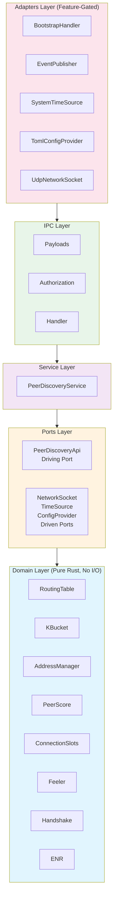
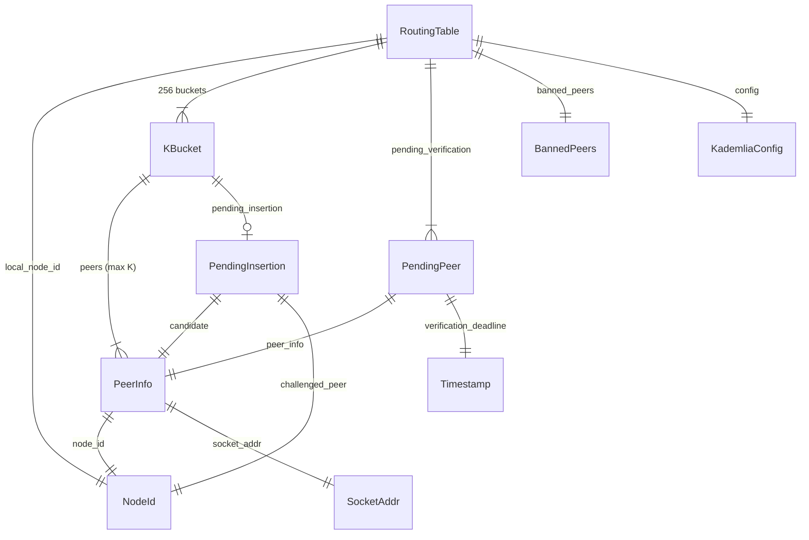
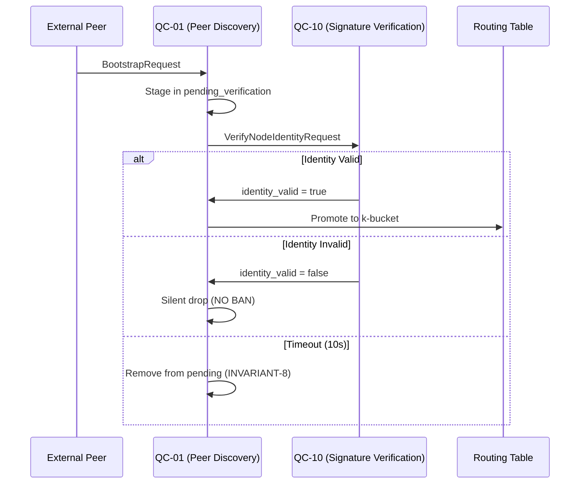
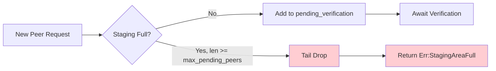
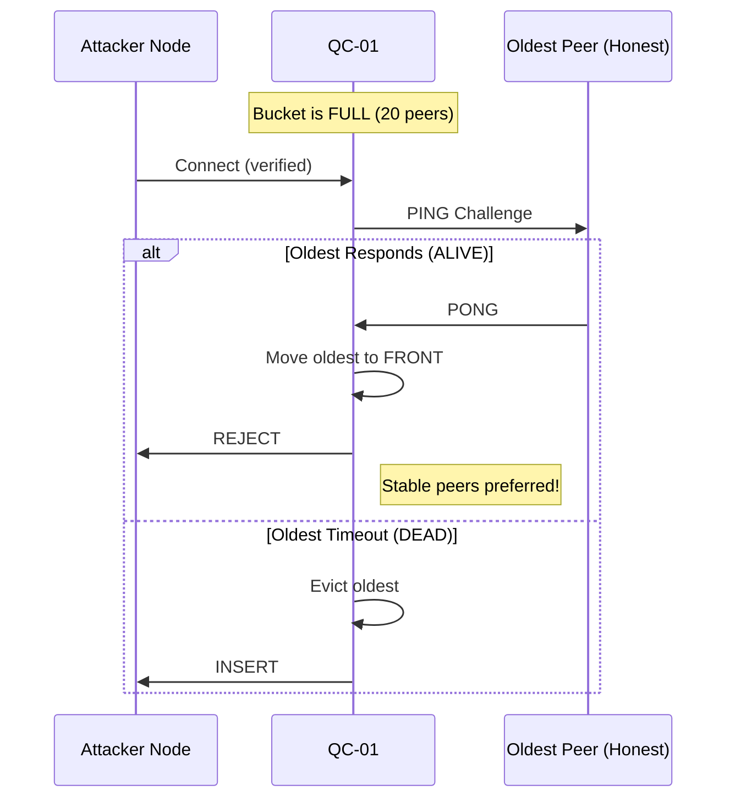
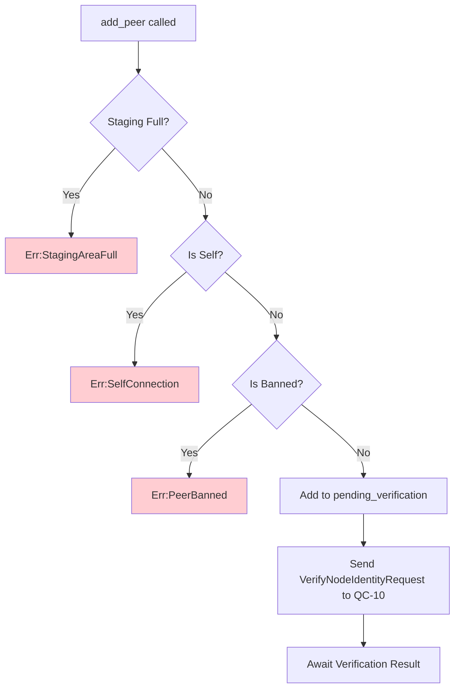
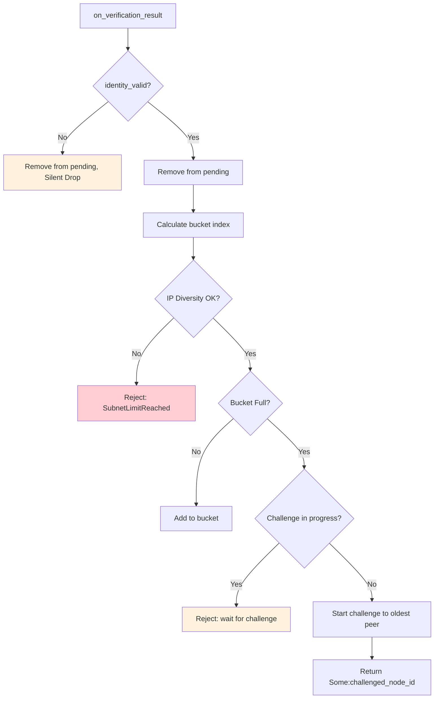
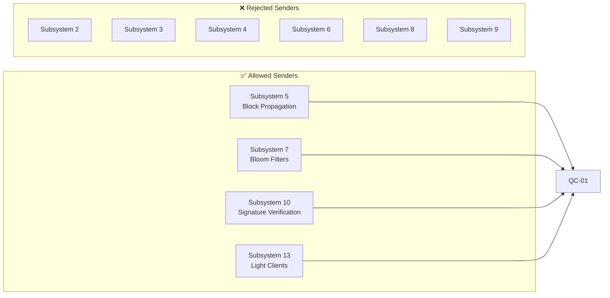

# Subsystem 01: Peer Discovery & Routing

**Crate:** `qc-01-peer-discovery`  
**Specification:** [`SPECS/SPEC-01-PEER-DISCOVERY.md`](../../SPECS/SPEC-01-PEER-DISCOVERY.md) v2.4  
**Architecture Compliance:** DDD + Hexagonal + EDA (Architecture.md v2.2)

---

## Table of Contents

1. [Overview](#overview)
2. [Quick Start](#quick-start)
3. [Architecture](#architecture)
4. [Domain Model](#domain-model)
5. [Security Invariants](#security-invariants)
6. [Data Flows](#data-flows)
7. [IPC Integration](#ipc-integration)
8. [Configuration](#configuration)
9. [Testing](#testing)
10. [Features & Dependencies](#features--dependencies)

---

## Overview

This crate implements the **Kademlia Distributed Hash Table (DHT)** for peer discovery and routing in the Quantum-Chain network.

### Scope Boundary

| In Scope | Out of Scope |
|----------|--------------|
| ✅ XOR distance calculation | ❌ Network I/O |
| ✅ K-bucket management | ❌ Block/transaction propagation |
| ✅ Routing table with all invariants | ❌ Consensus or validation |
| ✅ Peer lifecycle (discover, ban, evict) | ❌ Persistent storage |
| ✅ DDoS Edge Defense (staging) | ❌ Actual PING/PONG messages |

> **Note:** This is a **library** crate. The `node-runtime` wires it to network I/O.

### Quick Stats

| Metric | Value |
|--------|-------|
| **Domain Modules** | 12 |
| **Lines of Code** | ~15,000 |
| **Unit Tests** | 105+ |
| **Invariants Enforced** | 10 |
| **External Dependencies** | 0 (core) |

---

## Quick Start

```rust
use qc_01_peer_discovery::{
    PeerDiscoveryService, PeerDiscoveryApi,
    NodeId, PeerInfo, SocketAddr, IpAddr, Timestamp,
    KademliaConfig,
};

// 1. Create service with local node ID
let local_id = NodeId::new([0u8; 32]);
let config = KademliaConfig::default();
let mut service = PeerDiscoveryService::new(local_id, config);

// 2. Stage a new peer (awaits Subsystem 10 verification)
let peer = PeerInfo::new(
    NodeId::new([1u8; 32]),
    SocketAddr::new(IpAddr::v4(192, 168, 1, 100), 8080),
    Timestamp::new(1000),
);
service.add_peer(peer.clone())?;

// 3. After Subsystem 10 verifies identity
let challenged = service.on_verification_result(&peer.node_id, true)?;

// 4. Find closest peers
let closest = service.find_closest_peers(target_id, 20);
```

---

## Architecture

### Layer Diagram



### Directory Structure

```
crates/qc-01-peer-discovery/src/
├── lib.rs                 # Crate root, re-exports
├── domain/                # Pure business logic
│   ├── routing_table.rs   # Kademlia routing table (45KB)
│   ├── address_manager.rs # New/Tried buckets (Bitcoin addrman)
│   ├── peer_score.rs      # Gossip scoring
│   ├── connection_slots.rs# Score-based eviction
│   ├── feeler.rs          # Poisson-process probing
│   ├── handshake.rs       # Chain-aware handshakes
│   ├── enr.rs             # EIP-778 Node Records
│   ├── entities.rs        # Core entities
│   ├── errors.rs          # Error types
│   ├── services.rs        # Domain services
│   └── value_objects.rs   # Value types
├── ports/
│   ├── inbound.rs         # PeerDiscoveryApi trait
│   └── outbound.rs        # NetworkSocket, TimeSource, etc.
├── service.rs             # Service implementation
├── ipc/                   # Event bus integration
└── adapters/              # Concrete implementations
```

---

## Domain Model

### Core Entities

| Entity | Description | SPEC Reference |
|--------|-------------|----------------|
| `NodeId` | 256-bit Kademlia identifier | §2.1 |
| `PeerInfo` | Complete peer: ID, socket, reputation, last_seen | §2.1 |
| `RoutingTable` | 256 k-buckets + pending verification + banned | §2.2 |
| `KBucket` | Up to K peers at specific distance range | §2.2 |
| `PendingPeer` | Peer awaiting Subsystem 10 verification | §2.2 |
| `PendingInsertion` | Peer waiting for eviction challenge result | §2.2 |
| `BannedPeers` | Peers with temporary/permanent bans | §2.2 |

### Entity Relationship



---

## Security Invariants

### All 10 Invariants

| # | Invariant | Defense | Enforcement Location |
|---|-----------|---------|---------------------|
| 1 | Bucket Size ≤ K | Overflow protection | `routing_table.rs:458` |
| 2 | Local Node Immutable | Corruption prevention | `routing_table.rs:294` |
| 3 | IP Diversity | Sybil attack defense | `routing_table.rs:447` |
| 4 | Banned Exclusion | Policy enforcement | `routing_table.rs:373` |
| 5 | Self-Exclusion | Loop prevention | `routing_table.rs:368` |
| 6 | Distance Ordering | Correct bucket placement | `calculate_bucket_index` |
| 7 | Staging First | **DDoS Edge Defense** | `routing_table.rs:350` |
| 8 | Verification Timeout | Stale peer cleanup | `routing_table.rs:579` |
| 9 | Bounded Staging | **Memory Bomb Defense** | `routing_table.rs:362` |
| 10 | Eviction-on-Failure | **Eclipse Attack Defense** | `routing_table.rs:465` |

### DDoS Edge Defense Flow (INVARIANT-7, 8)



### Memory Bomb Defense (INVARIANT-9)



| Parameter | Default | Memory Impact |
|-----------|---------|---------------|
| `max_pending_peers` | 1024 | ~128 KB max |
| Tail Drop Strategy | First-come-first-served | No eviction of honest work |

### Eclipse Attack Defense (INVARIANT-10)



**Security Guarantee:** Attackers cannot displace healthy peers. To take over a bucket, all 20 honest peers must naturally go offline.

---

## Data Flows

### Peer Addition Flow



### Verification Result Flow



---

## IPC Integration

### Message Matrix

#### Inbound Messages

| Message | Source Subsystems | Handler Method |
|---------|-------------------|----------------|
| `PeerListRequest` | 5, 7, 13 | `handle_peer_list_request` |
| `FullNodeListRequest` | 13 | `handle_full_node_list_request` |
| `BootstrapRequest` | External | `BootstrapHandler::handle` |
| `NodeIdentityVerificationResult` | 10 | `handle_verification` |

#### Outbound Messages

| Message | Target | Publisher Trait |
|---------|--------|-----------------|
| `PeerListResponse` | 5, 7, 13 | `PeerDiscoveryEventPublisher` |
| `VerifyNodeIdentityRequest` | 10 | `VerificationRequestPublisher` |
| `PeerConnected` | Event Bus | `PeerDiscoveryEventPublisher` |
| `PeerDisconnected` | Event Bus | `PeerDiscoveryEventPublisher` |

### Authorization Rules



---

## Configuration

### KademliaConfig

| Parameter | Default | Description |
|-----------|---------|-------------|
| `k` | 20 | Bucket size |
| `alpha` | 3 | Lookup parallelism |
| `max_peers_per_subnet` | 2 | IP diversity (INVARIANT-3) |
| `max_pending_peers` | 1024 | Memory bound (INVARIANT-9) |
| `verification_timeout_secs` | 10 | Staging timeout (INVARIANT-8) |
| `eviction_challenge_timeout_secs` | 5 | Challenge timeout (INVARIANT-10) |

```rust
let config = KademliaConfig {
    k: 20,
    alpha: 3,
    max_peers_per_subnet: 2,
    max_pending_peers: 1024,
    verification_timeout_secs: 10,
    eviction_challenge_timeout_secs: 5,
};
```

---

## Testing

### Run Tests

```bash
# All tests with all features
cargo test -p qc-01-peer-discovery --all-features

# Specific test group
cargo test -p qc-01-peer-discovery test_invariant

# With verbose output
cargo test -p qc-01-peer-discovery --all-features -- --nocapture
```

### Test Coverage Matrix

| Test Group | Count | SPEC Reference |
|------------|-------|----------------|
| XOR Distance | 4 | §5.1 Group 1 |
| K-Bucket Management | 8 | §5.1 Group 2 |
| IP Diversity | 3 | §5.1 Group 3 |
| Peer Lifecycle | 4 | §5.1 Group 4 |
| Ban System | 3 | §5.1 Group 5 |
| Pending Verification | 5 | §5.1 Group 6 |
| Bounded Staging | 5 | §5.1 Group 7 |
| Eviction-on-Failure | 8 | §5.1 Group 8 |
| IPC Authorization | 6 | IPC-MATRIX §1 |

---

## Features & Dependencies

### Feature Flags

| Feature | Description | Dependencies Added |
|---------|-------------|-------------------|
| *(default)* | Core library | **None** |
| `ipc` | Event bus integration | `shared-types`, `hmac`, `sha2` |
| `rpc` | API Gateway integration | `serde`, `serde_json` |
| `bootstrap` | Bootstrap handler | `uuid` |
| `network` | UDP/TOML adapters | `tokio`, `toml` |
| `test-utils` | Testing utilities | *None* |

### Zero-Dependency Core

The core library (`domain/`, `ports/`, `service.rs`) has **ZERO external dependencies**:

```toml
[dependencies]
# Core: No dependencies!

# Feature-gated only:
shared-types = { path = "../shared-types", optional = true }
hmac = { version = "0.12", optional = true }
sha2 = { version = "0.10", optional = true }
uuid = { version = "1.0", features = ["v4"], optional = true }
serde = { workspace = true, optional = true }
serde_json = { workspace = true, optional = true }
tokio = { workspace = true, optional = true }
toml = { version = "0.8", optional = true }
```

---

## Related Documentation

| Document | Description |
|----------|-------------|
| [SPEC-01-PEER-DISCOVERY.md](../../SPECS/SPEC-01-PEER-DISCOVERY.md) | Full specification |
| [Architecture.md](../../Documentation/Architecture.md) | System architecture |
| [IPC-MATRIX.md](../../Documentation/IPC-MATRIX.md) | IPC authorization matrix |
| [System.md](../../Documentation/System.md) | Overall system design |

---

## License

See repository LICENSE file.
